**Instructions for visualizing vehicle trajectories as space-time diagrams using
NeXTA**

NGSIM data set

Version 1: Prepared by Xuesong (Simon) Zhou

<https://www.youtube.com/@dlsim-mrm2898> [DLSim-MRM -
YouTube](https://www.youtube.com/@dlsim-mrm2898) maintained by Cafer Avci

Version 2 and revision made by Pan Shang, Zhangyan Cui and Roy Luo

Package :
<https://github.com/asu-trans-ai-lab/NeXTA4GMNS/blob/gh-pages/2Dtrajectory_visulization/NeXTA4_Trajectory_package.zip>

| Category      | File                         | Remark                                                   |
|---------------|------------------------------|----------------------------------------------------------|
| Main program  | NEXTA_4_Trajectory.exe       | Open source NEXTA visualization tool                     |
| Input         | trajectories-0400-0415       | Sample file from NGSIM                                   |
| Input         | test_one_line test_two_lines | Sample file from Pan Shang, for one vehicle’s trajectory |
| Output        | Trajectory.csv               | Export to more user readable format                      |

# About Next Generation Simulation (NGSIM)

<https://ops.fhwa.dot.gov/trafficanalysistools/ngsim.htm>

# 2. Install and Data Format

Download the NeXTA tool (NEXTA_4_Trajectory.exe) from
<https://github.com/asu-trans-ai-lab/NeXTA4GMNS>

The vehicle trajectory information is stored in the text file with a ‘.txt’
extension and each line represents a record of a car’s trajectory/path. The
fields should be separated by either a space or a comma. The column field are
listed below.

| No | Field Name           | Example 1     | Example 2     | Unit | remark                                    |
|----|----------------------|---------------|---------------|------|-------------------------------------------|
| 1  | Vehicle_ID           | 1             | 1             |      |                                           |
| 2  | Frame_ID             | 12            | 13            |      | 0.1 seconds                               |
| 3  | Total_Frames         | 884           | 884           |      | 0.1 seconds                               |
| 4  | Global_Time          | 1113433136100 | 1113433136200 |      | any value but likely to be unix timestamp |
| 5  | Local_X              | 16.884        | 16.938        |      | not used in NeXA                          |
| 6  | Local_Y              | 48.213        | 49.463        | feet |                                           |
| 7  | Global_X             | 6042842.116   | 6042842.012   |      | not used in NeXTA                         |
| 8  | Global_Y             | 2133117.662   | 2133118.909   |      | not used in NeXTA                         |
| 9  | Vehicle_Length       | 14.3          | 14.3          | feet |                                           |
| 10 | Vehicle_Width        | 6.4           | 6.4           | feet |                                           |
| 11 | Vehicle_Class        | 2             | 2             |      | passenger car or truck                    |
| 12 | Vehicle_Velocity     | 12.5          | 12.5          |      |                                           |
| 13 | Vehicle_Acceleration | 0             | 0             |      |                                           |
| 14 | Lane_Identification  | 2             | 2             |      | important                                 |
| 15 | Preceding_Vehicle    | 0             | 0             |      |                                           |
| 16 | Following_Vehicle    | 0             | 0             |      |                                           |
| 17 | Spacing              | 0             | 0             |      |                                           |
| 18 | Headway              | 0             | 0             |      |                                           |

# 2. Quick Start

## 2.1 Open NeXTA

Double-click the NEXTA_4_Trajectory.exe executable.

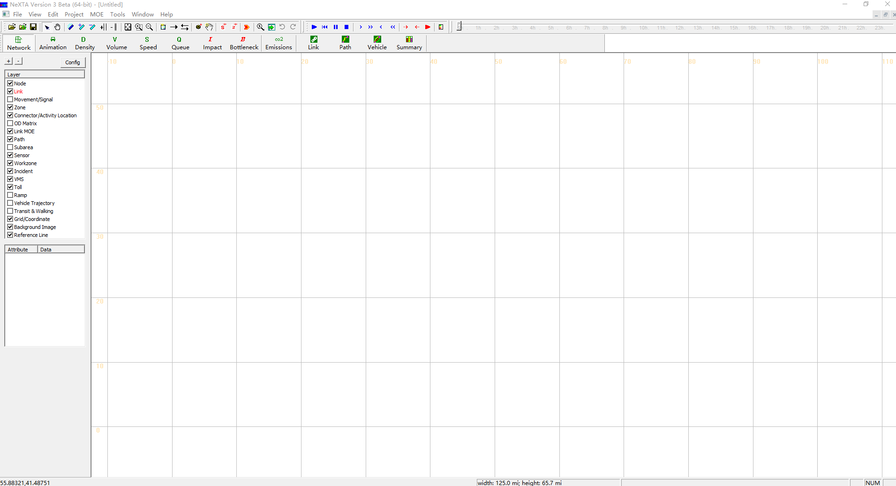

## Load trajectory file

Select menu ‘Tools’ → ‘NGSIM Tools’ → ‘Active Space-Time View’, and then load
trajectory file in txt format.

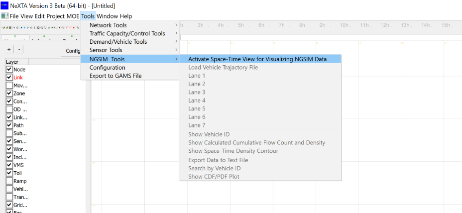

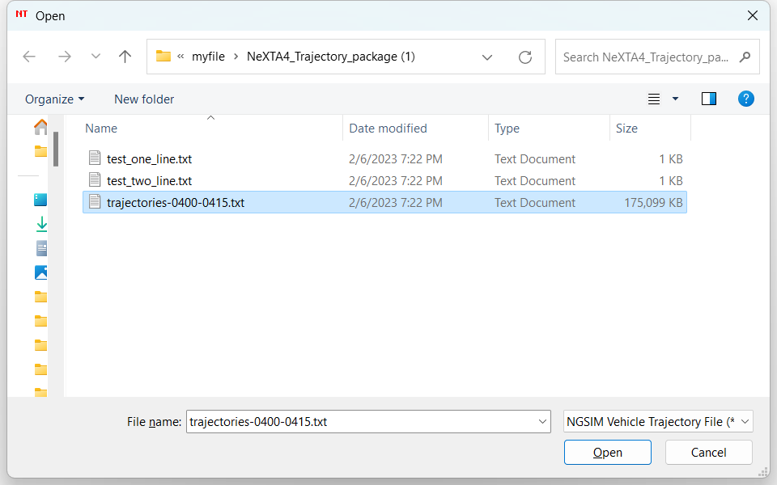

Once the file is loaded, the vehicle trajectories will be displayed in the
current active window as shown below. 

## Display trajectories for each lane.

Users can choose a lane number to visualize the trajectory using the menu
‘Tools’ → ‘NGSIM Tools’.

For example, the vehicle trajectories of lane 1:

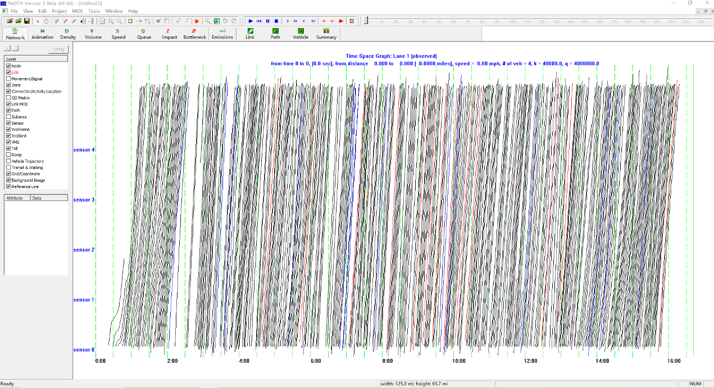

the vehicle trajectories of lane 7:

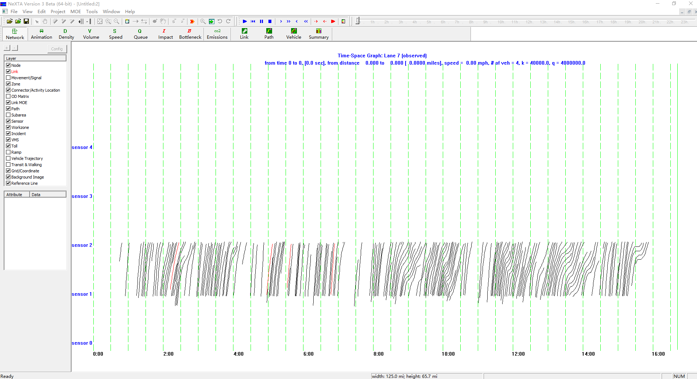

## Show Vehicle ID

Users can show the vehicle ID in the menu ‘Tools’ → ‘NGSIM Tools’ and use mouse
wheeler to zoom in and zoom out the display for the certain area of the
space-time diagram.

## 3. Advanced Functions

## 3.1 Calculate the flow by clicking-and-drawing a line in the space-time plane

With the mouse, users can draw a line in the space-time plane, and NeXTA will
automatically calculate the flow, density, and speed of vehicles that travel
along the line.

## 3.2 Show cumulative flow count and density

Users can show cumulative flow count and density using the menu ‘Tools’ → ‘NGSIM
Tools’.

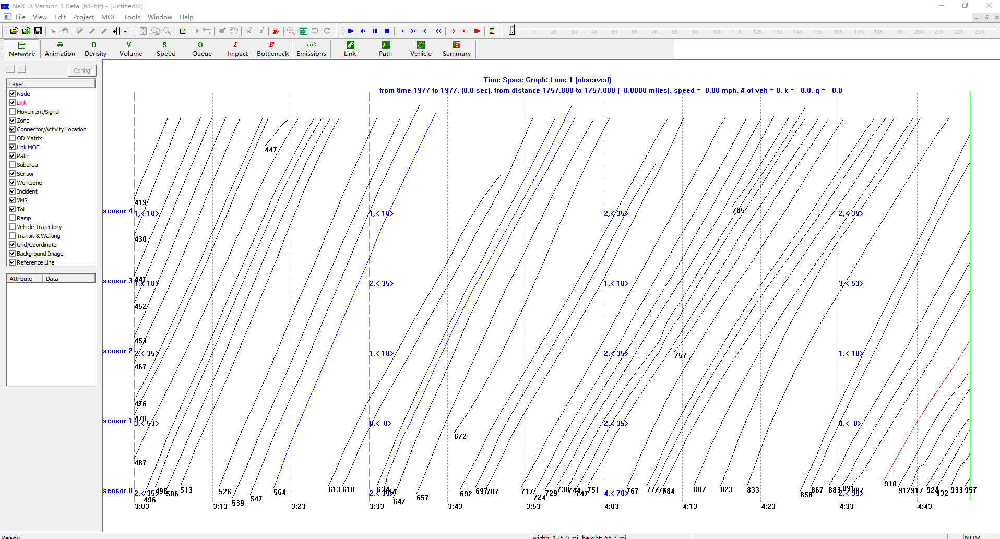

## 3.3 Show the space-time density contour

Users can show cumulative flow count and density using the menu ‘Tools’ → ‘NGSIM
Tools’.

## 3.4 Show CDF/PDF plot

Users can show the CDF/PDF plot using the menu ‘Tools’ → ‘NGSIM Tools’.

## 3.5 Export the data to text files for analysis of individual vehicles.

Users can show the CDF/PDF plot using the menu ‘Tools’ → ‘NGSIM Tools’-\>Export
Data to Text File.

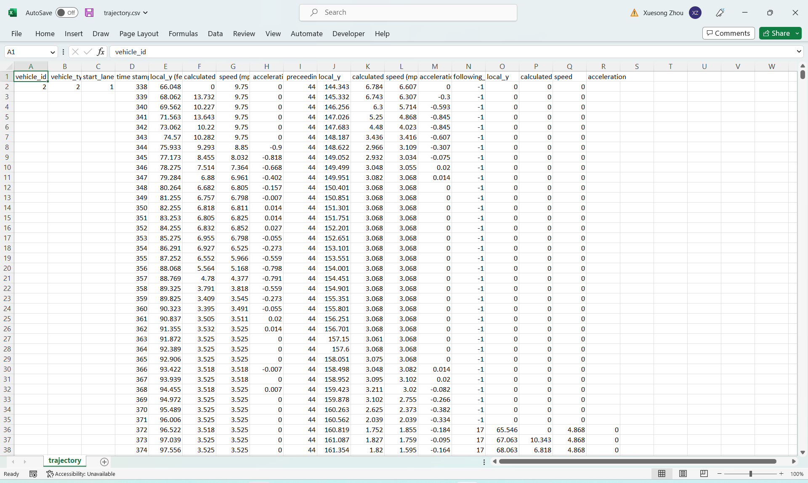

**4. Homework questions:**

1) Find Vehicle id 1757 on lane 4, find the vehicle ids before and after this
vehicle.

2) Use the mouse to draw a line to find the speed for vehicle 1757

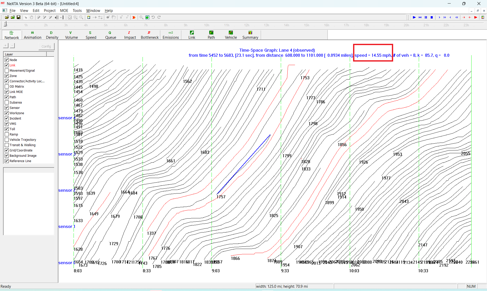

3) Use the mouse to draw a line to find density at timestamps 9:00, 8:30 and
9:30. 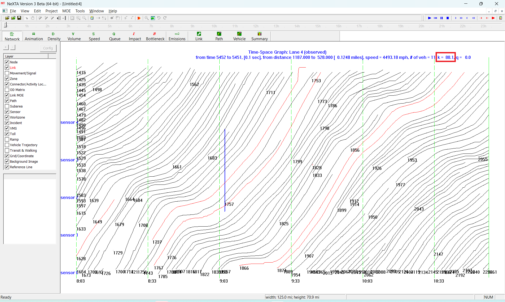

4) Use the mouse to draw a line to find Kjam and backwave speed.

5) Export the vehicle trajectory to a text file, compute the average speed and
and maximum acceleration for vehicles 1757 and 1767.

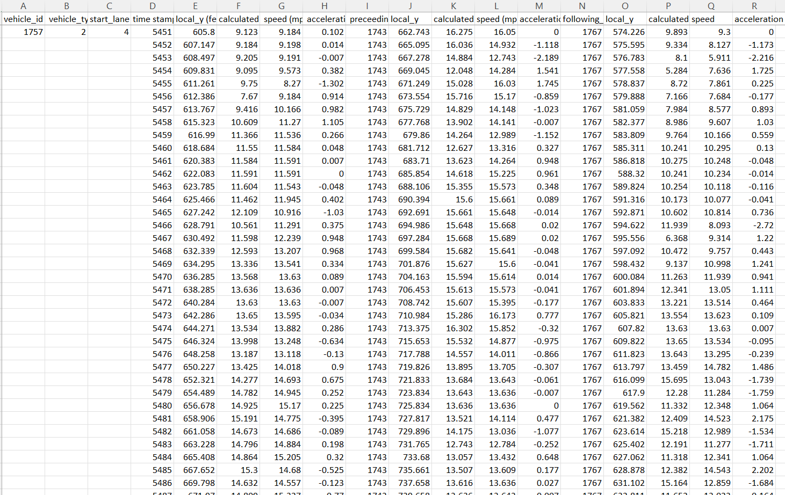

References:

[Full article: DTALite: A queue-based mesoscopic traffic simulator for fast
model evaluation and calibration
(tandfonline.com)](https://www.tandfonline.com/doi/full/10.1080/23311916.2014.961345)

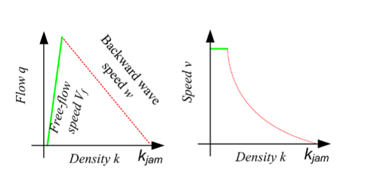

Illustration of forward and backward wave representation in Newell’s simplified
KW model.
